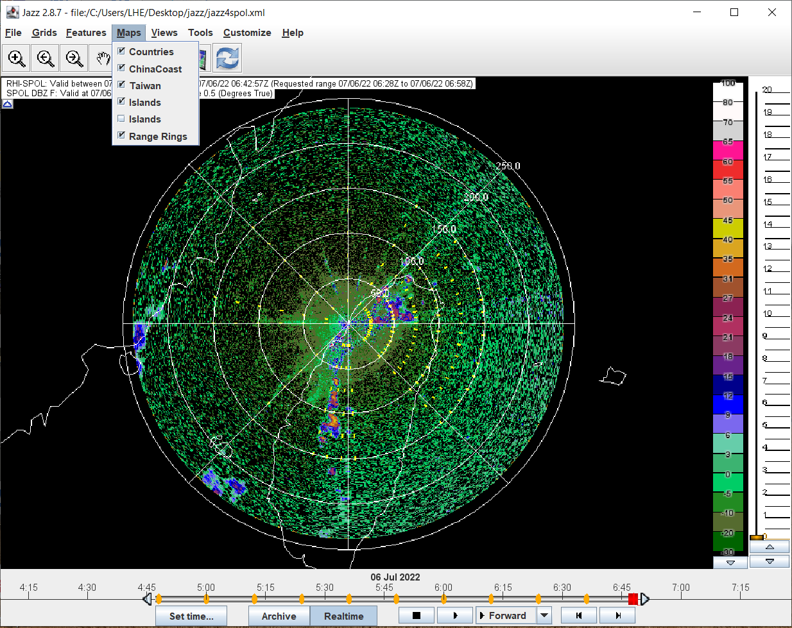

# Installing and running the Jazz display for PRECIP

## Introduction

The NCAR-based data for the PRECIP displays resides on a server at EOL in Boulder.

You can access that data for display purposes, using either CIDD or Jazz.

Jazz is a Java-based display supported by the Research Applications Laboratory (RAL) at NCAR.

See the Jazz main page at:

* [https://projects.ral.ucar.edu/jazz/](https://projects.ral.ucar.edu/jazz/)

## Installing Java

You will need to install the latest OpenJdk version to run Jazz.

Open JDK vesion 18 is available from:

* [https://jdk.java.net/18/](https://jdk.java.net/18/)

### Installing OpenJDK on Windows:

The following is a tutorial from PRECIP participants on how to install openJDK 18 on Windows:

* [JazzInstallOnWindows.pdf](./JazzInstallOnWindows.pdf)

The following video shows how to install OpenJDK 18 on Windows:

* [https://www.youtube.com/watch?v=DSwGFXjB8U8](https://www.youtube.com/watch?v=DSwGFXjB8U8)

### Installing OpenJDK on Linux or Mac

Download the ```tar.gz``` file from:

* [https://jdk.java.net/18/](https://jdk.java.net/18/)

Untar this in a ```java``` subdirectory of your home directory.

In this example we are downloading ```openjdk-18.0.1.1```.

```
  mkdir ~/java
  cd ~/java
  tar xvfz ~/Downloads/openjdk-18.0.1.1_linux-x64_bin.tar.gz
```  

Then, in your environment, set JAVA_HOME:

```
  setenv JAVA_HOME ~/java/jdk-18.0.1.1
```

or:

```
  export JAVA_HOME=$HOME/java/jdk-18.0.1.1
```

And add ```$JAVA_HOME/bin``` to your path.

Then you should be able to run:

```
  which java
```

and get the response:

```
  /home/user/java/jdk-18.0.1.1/bin/java
```

## Downloading jazz and the jazz .xml parameter files

Put these in ```~/jazz```.

From the Jazz web page:

* [https://projects.ral.ucar.edu/jazz/](https://projects.ral.ucar.edu/jazz/)

download ```jazz.zip```, and follow the instructions on unzipping it.

```
  mkdir ~/jazz
  cd ~/jazz
  unzip ~/Downloads/jazz.zip
```

## Starting jazz

Run the start script. On Linux or Mac, this will be:

```
  cd ~/jazz
  chmod +x runJazz.sh
  ./runJazz.sh
```

Jazz will start, and request that you select a parameter file.

The file loader dialog is as follows:


Click the checkbox to Automatically reload the previous configuration on startup.

Then cut and paste one of the following URLs into the file chooser:

**S-Pol-centric configuration (km coords)**

Parameter file:
```
https://raw.githubusercontent.com/NCAR/lrose-projects-precip/main/projDir/display/params/jazz4spol.xml
```


**Wider display configuration, including satellite, models etc. (latlon coords)**

Parameter file:
```
https://raw.githubusercontent.com/NCAR/lrose-projects-precip/main/projDir/display/params/jazz4precip.xml
```


## Using the Jazz GUI

### File menu

You can:

* Reset Application - go back to starting configuration
* Load Configuration File - see above
* Export images - make images from existing plots


### Grid table pin-up

This is the most useful way to pin up the list of available fields:


The following is an example - selecting the VEL_F (filtered velocity) field:


### Grid menu pop-up

This is an alternative to the grid table - pop up the menu and pick the field you want:


### Features menu

Turn on and off the overlay features you wish to see drawn on top of the selected field:


### Turning the maps on and off



### Pre-defined views

You can select from a series of pre-defined zoom states:


### Interactive zooming

Select the ```+``` magnifiying glass at the left of the tool bar.

The drag with the left mouse button to describe the zoom rectangle.


The left and right arrows are ```Go back``` and ```Go forward``` through the zooms.

If you select the ```Hand``` tool, you can pan the zoomed view to fine-tune the location.

### Inspecting data values

Click on the ```i``` information tool. Then move the mouse over the data, to inspect the data value at the selected (x,y) location.


### Vertical sections

To create a vertical section, select the vertical section tool (second from the right).

Click the start point for your vertical section, followed by one or more way points.

End by double clicking.

The vertical section window will appear.


### RHIs

RHIs are a special case of a vertical section.

The RHI locations are shown by the yellow tick marks radiating from the radar.

Click on the radar location to start the RHI.


Then double click on an end point aligned with one set of yellow tick marks.

If you click close to the actual RHI azimuth you will get a measured RHI:


If you are not accurate with your click points you will get a reconstructed RHI:


### Setting the time, and the movie loops


### Tools menu

The most useful is the ```Grid Table```.


### views_menu2.png


### color_scale_menu.png


### color_scale_editor.png


### customize_features.png


### customize_maps.png


BTW - if you go to 'Realtime' - i.e. the current time - using the time controller at the bottom, you will need to click on a time in the time slider to get the data to retrieve and display correctly.

      
