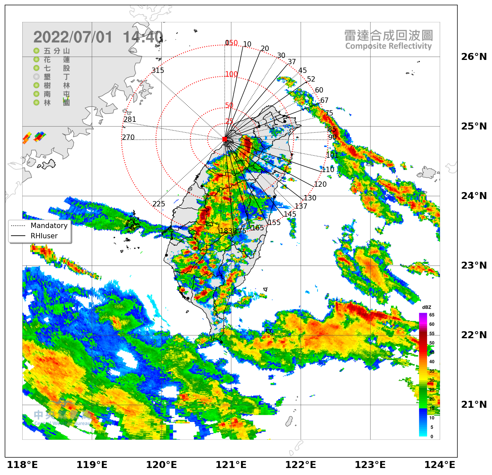

# Running the GUI for different scan strategies

## Switching between schedules

There are 2 main schedules for PRECIP:

Note that it is critical to sync up on the 12 minute mark for coordination with SEA-POL.

* PrecipIOP
* PrecipUnattended

### (a) Switching from Unattended to IOP

* Wait until you are in PrecipSur2
* Stop Scan
* File -> Open -> scan-you-want.json
* File -> Save As -> default.json
* Schedule -> Select PrecipIOP
* Set Start At to next 12 minute boundary (hit Enter)
* Click Apply
* File -> Save
* Run Scan

The scan will start immediately, and then interrupt at the next 12 minute boundary.

### (b) Switching from IOP to Unattended

* Wait until you are in PrecipRhiUser
* Stop Scan
* Schedule -> Select PrecipUnattended
* Set Start At to next 12 minute boundary (hit Enter)
* Click Apply
* File -> Save
* Run Scan

The scan will start immediately, and then interrupt at the next 12 minute boundary.

## Recovering from SYS_IDLE insertion

Sometimes a SYS_IDLE becomes inserted in the current schedule, and the scan will stop.

This occurs if you inspect the RHI angle list and hit OK instead of Cancel.

If you do not want to change the RHI angles, then DO NOT double-click on PrecipRhiUser. Rather, hover the mouse over ```PrecipRhiUser``` in the ```AngleList``` - the list of active angles will show.

If a SYS_IDLE does appear, stop the scan and restart as follows:

* Stop Scan
* Select Schedule you want
* Set Start At to next 12 minute boundary (hit Enter)
* Click Apply
* File -> Save
* Run Scan

The scan will start immediately, and then interrupt at the next 12 minute boundary.

## Changing the list of RHI angles in the PrecipIOP schedule

### (a) Enter angles manually

* Ensure you are in the PrecipIOP schedule (see above)
* Do not do this while PrecipRhiUser is running - best to do this in PrecipSur1 since that allows plenty of time
* Click on the main RHI tab
* In the RHI list box (left), select PrecipRhiUser
* In the AngleList box (right), double click on PrecipRhiUser
* A window with the current angles will pop up
* Set the angles you want - you can either type them in, or use the ```Fill with Equal Angle``` option
* You should enter 12 RHI angles
* If you make a mistake, click on Cancel
* If you are happy, click OK (DON'T do this if you have not made any changes)

The new angle list will take effect the next time PrecipRhiUser runs.

### (b) Read in a file with the desired angles

* Ensure you are in the PrecipIOP schedule (see above)
* Do not do this while PrecipRhiUser is running - best to do this in PrecipSur1 since that allows plenty of time
* File -> Open -> scan-you-want.json
* File -> Save As -> default.json

The new angle list will take effect the next time PrecipRhiUser runs.

## Mandatory scans used in the schedules - (9 min 17 sec)

### (1) PrecipRhi1 ***MUST START ON 12-MIN MARK TO SYNC WITH SEA-POL***

* S-Pol scheduler task name/angle list: PrecipRhi1
* Number of RHIs: 2
* Scan rate: 6°/s
* Total scan time: 48 seconds
* Elevation angle range: 0-90°
* Sequence: Azimuth 101° (toward SEA-POL), Turn at vertical (10 sec dwell for bias correction), then Azimuth 281° (opposite SEA-POL angle)

### (2) PrecipSur1 (surveillance, QPE, TEAM-R dual-Doppler)

* S-Pol scheduler task name/angle list: PrecipSur1
* Number of elevation angles: 10
* Scan rate: 10.5°/s (max comfortable PPI scan rate for S-Pol)
* Total scan time: 6 min 3 sec (363 seconds)
* Azimuthal range: 0-360°
* Elevation angles: 0.5°, 1.0°, 1.5°, 2.0°, 3.0°, 4.0°, 5.0°, 7.0°, 9.0°, 11.0°

### (3) PrecipRhi2 - cardinal directions and important sites with modifications for reflection/clutter issues

* S-Pol scheduler task name/angle list: PrecipRhi2
* Number of RHIs: 12
* Scan rate: 6°/s
* Total scan time: 2 min 17 sec (137 seconds)
* Elevation angle range: 0-50°
* Azimuthal angles: 90.0° (C), 85.0° (Hsin-Chu weather station, radiosondes, MPD), 75.0° (near WuFenShan CWB radar, offset from 72.0° due to interference), 60.0° (NCU disdrometer, MPD), 45.0° (C), 30.0° (TEAM-R at 29° but had to offset because of reflection issue), 0.0° (C), 315.0° (C), 270.0° (C), 225.0° (C), 183.0° (C offset due to clutter issue), 137.0° (C offset due to clutter issue)

## Optional scans - user-selected (~2-2.5 min)

### PrecipRhiUser (in schedule PrecipIOP)

* S-Pol scheduler task name/angle list: PrecipRhiUser
* Number of RHIs: 12 
* Scan rate: 6°/s
* Total scan time: 2 min 9 sec (129 seconds); time estimate for 3° azimuthal spacing
* Elevation angle range: 0-50°
* Have flexibility in choosing the azimuth angles in the scan scheduler by changing angles in the PrecipRhiUser list only
* The Angle List can populate the angles for you by defining the half-width of the sector, the azimuthal spacing, and the center azimuth. For example, a 36 degree sector with 3 azimuthal spacing will be populated with 12 angles if width=18, step=3, center=center azimuth
* Can consider centering on specific locations of interest, for example:
* NCU: 3° azimuthal spacing over a 30° sector centered near NCU at 60° azimuth (angles = 42.0°, 45.0°,48.0°, 51.0°, 54.0°, 57.0°, 60.0°, 63.0°, 66.0°, 69.0°, 72.0°, 75.0°)
* TEAM-R: located at 29° azimuth
* Problematic azimuthal angles to avoid: 29.0°, 135.0°, 180.0°
* Can fit in 5-deg spacing with recommendation to order the RHIs so the end angle is the one closest to 101° (the start angle for mandatory RHI1) 

### PrecipSur2 (in schedule PrecipUnattended)

* S-Pol scheduler task name: PrecipSur2
* Number of elevation angles: 4
* Scan rate: 10.5°/s 
* Total scan time: 2 min 21 sec (181 seconds)
* Azimuthal range: 0-360°
* Elevation angles: 0.5°, 1.0°, 1.5°, 2.0°
* This sequence will primarily be used for unattended mode when deep precipitation not likely (considered the non-IOP unattended mode)

Point radar to 101° to prepare for start of next sequence 

Have 10-25 seconds remaining depending on the user-selected strategy, which allows for enough of a safety net to prepare for the next scan sequence to start on time.

## Angle lists for PrecipRhiUser, by file name:

### east.json:

```
  10, 20, 37, 52, 67, 110, 120, 130, 145, 155, 165, 175
```


### full360.json

```
  15, 345, 330, 298, 255, 240, 211, 197, 168, 153, 125, 113
```

### initiation.json

```
  211, 203, 195, 189, 177, 171, 125, 113, 107, 95, 80, 67.5
```

### north.json

```
  290, 300, 310, 320, 330, 340, 350, 10, 20, 37, 52, 67
```

### northeast.json

```
  320, 330, 340, 350, 10, 20, 37, 52, 67, 110, 120, 130
```

### northwest.json

```
  240, 255, 290, 300, 310, 320, 330, 340, 350, 010, 020, 037
```

### south.json

```
  255, 240, 215, 205, 195, 175, 165, 155, 145, 130, 120, 110
```

### southeast.json

```
  215, 205, 195, 175, 165, 155, 145, 130, 120, 110, 67, 52
```

### southwest.json

```
  310, 300, 290, 255, 240, 215, 205, 195, 175, 165, 155, 145
```

### west.json

```
  350, 340, 330, 320, 310, 300, 290, 255, 240, 215, 205, 195
```
